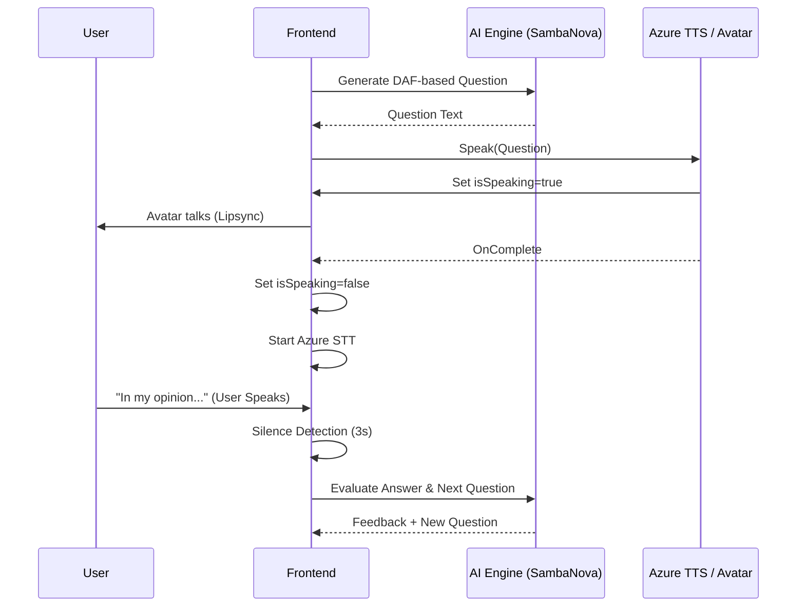

# AI Video Interview Implementation Plan

This plan outlines the architecture and steps to implement a high-fidelity, real-time AI Video Interview feature using a photorealistic 3D avatar, ultra-fast inference, and intelligent session analysis.

## User Review Required

> [!IMPORTANT]
> The implementation relies on **Azure Cognitive Services** for high-quality Speech-to-Text and Text-to-Speech. Ensure these keys are configured in `.env.local`.

> [!TIP]
> We will use **SambaNova Systems** or **Groq** (via `callAIWithFallback`) for ultra-low latency question generation and evaluation to maintain the "real-time" feel.

## Proposed Architecture

### 1. High-Level System Architecture

```mermaid
graph TD
    %% Styling
    classDef frontend fill:#e0f2fe,stroke:#0284c7,stroke-width:2px;
    classDef backend fill:#f0fdf4,stroke:#16a34a,stroke-width:2px;
    classDef ai fill:#f3e8ff,stroke:#9333ea,stroke-width:2px;

    User([User]) <-->|Video/Audio| FE[Interview Prep Page]
    
    subgraph "Frontend Components"
        FE -->|Avatar State| AI_Avatar[AIVideoInterviewer (3D)]
        FE -->|User Feed| Webcam[UserWebcam]
        FE -->|Capture| STT[Azure STT Service]
        FE -->|Play| TTS[Azure TTS Service]
    end

    subgraph "Backend Services"
        FE -->|API Request| NextAPI[Next.js API Routes]
        NextAPI -->|Query| DB[(MongoDB)]
        NextAPI -->|Inference| LLM[SambaNova/OpenAI]
    end

    STT -->|Transcript| FE
    FE -->|Text| TTS
    TTS -->|Sync| AI_Avatar

    class FE,AI_Avatar,Webcam,STT,TTS frontend;
    class NextAPI backend;
    class LLM,DB ai;
```

### 2. Interaction Sequence (The "Interview Loop")



---

## Proposed Changes

### [Component] [AIVideoInterviewer](file:///c:/Users/manas/Desktop/Indicore(UPSC)/components/AIVideoInterviewer.js)
Enhance the 3D avatar's responsiveness and visual quality.
- [ ] Implement more fluid procedural eye-blinking and head-bobbing.
- [ ] Refine the `isSpeaking` logic to sync more accurately with audio intensity.

### [Component] [InterviewPrepPage](file:///c:/Users/manas/Desktop/Indicore(UPSC)/app/interview-prep/page.js)
The main orchestrator for the interview flow.
- [ ] **[MODIFY]** Enhance the `isVideoMode` transition for a "Studio" feel.
- [ ] **[MODIFY]** Improve the `silenceTimerRef` to be more robust (avoiding accidental cuts).
- [ ] **[MODIFY]** Integrate DAF context more deeply into the live session.

### [API] [Generate Questions](file:///c:/Users/manas/Desktop/Indicore(UPSC)/pages/api/interview/generate-questions.js)
- [ ] **[MODIFY]** Update prompts to ensure "Board Member" persona is strictly maintained.
- [ ] **[MODIFY]** Ensure questions are optimized for voice interaction (short, punchy).

---

## Verification Plan

### Automated Tests
- [ ] Run `npm run lint` to ensure no breaking changes in styling.
- [ ] (Future) Add Playwright/Cypress tests to verify the video mode toggle.

### Manual Verification
1.  **Avatar Sync**: Enable Video Mode and check if the avatar's jaw moves correctly when it reads a question.
2.  **STT Robustness**: Speak an answer in Hindi and English; verify that Azure STT captures the transcript accurately.
3.  **Silence Detection**: Stop speaking for 3 seconds and verify that the "Evaluate" function triggers automatically in video mode.
4.  **DAF Integration**: Upload a mock DAF and verify that generated questions are specific to the uploaded text.
