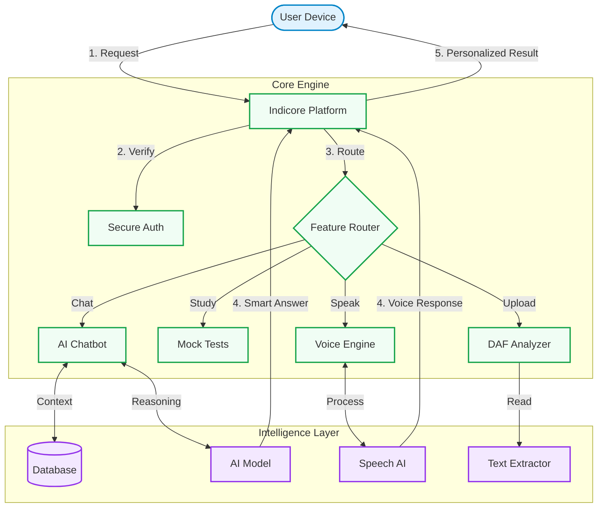
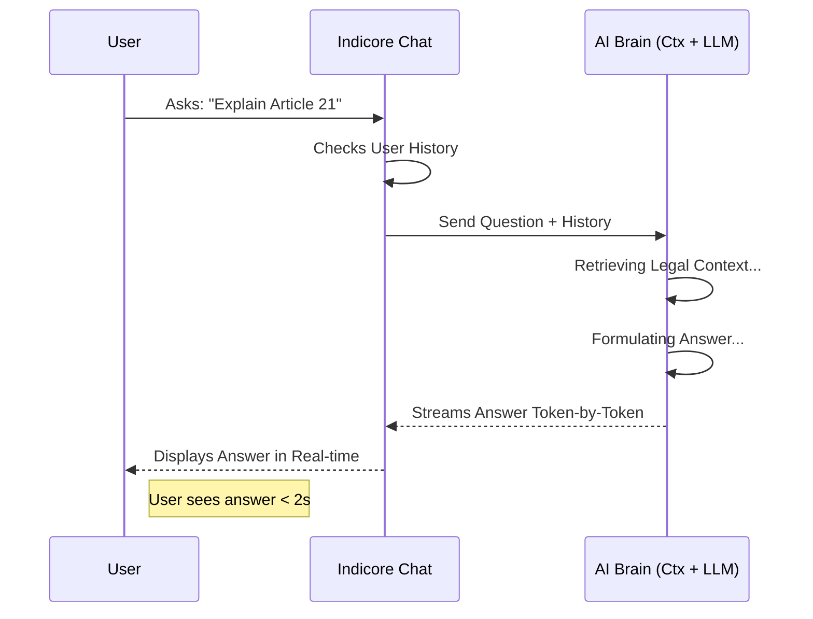
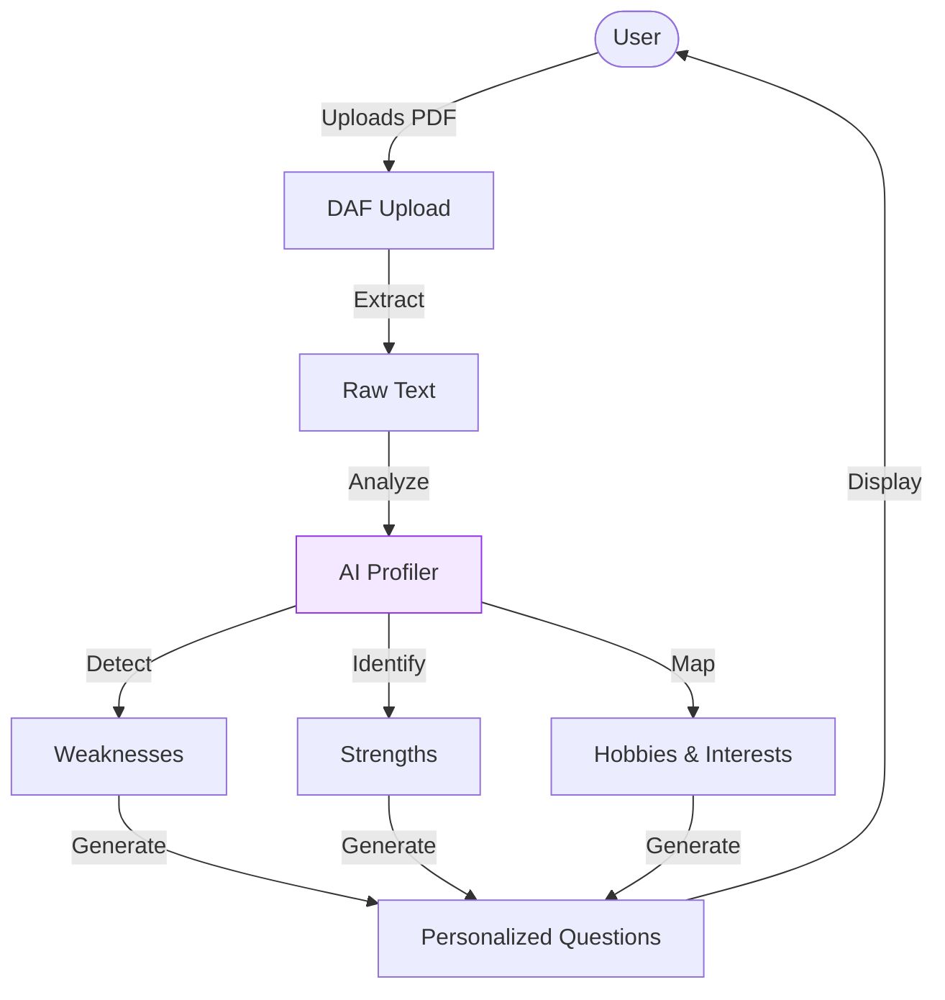
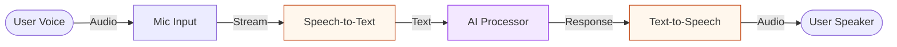
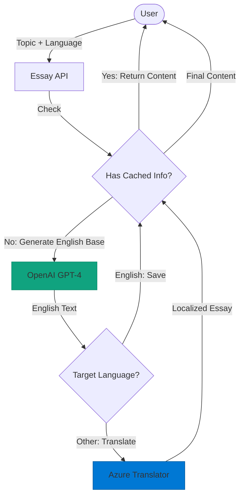
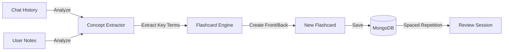
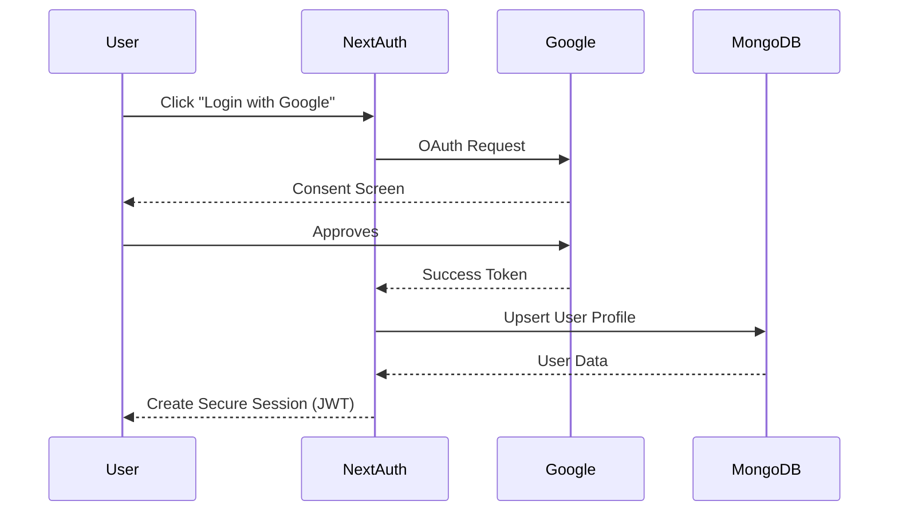
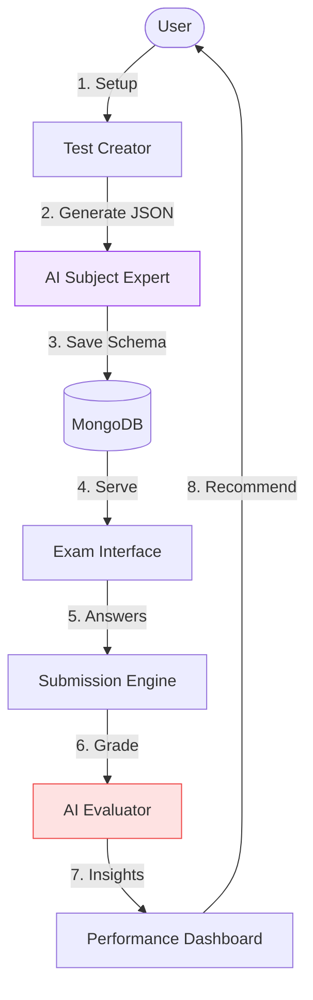

# Indicore

## 🎯 Overview

**Indicore** is an AI-powered UPSC exam preparation platform designed to revolutionize how aspirants study. With 15+ intelligent tools, personalized learning, and ChatGPT-style memory, Indicore adapts to your unique learning style and goals.

### Key Highlights

- 🤖 **AI-Powered Chat** with PYQ context and memory
- 🧠 **Smart Memory System** that learns from conversations
- 📝 **Complete Mock Test Suite** with AI evaluation
- 📚 **10,000+ PYQ Database** with pattern analysis
- ✍️ **Essay Writing Tools** with automated feedback
- 🎯 **Interview Preparation** with DAF-based questions
- 🎤 **Voice Interface** (Speech-to-Text & Text-to-Speech)
- 🌐 **Multi-language Support** (10+ Indian languages)
- 📊 **Learning Analytics** with personalized insights
- 🔖 **Smart Bookmarks** and content organization

---

## 🚀 Quick Start

### Prerequisites

- Node.js 18+ installed
- MongoDB database (local or Atlas)
- API Keys for:
  - OpenAI
  - Azure Cognitive Services (Speech + Translator)
  - Google Cloud (OAuth + Translate)

### Installation

```bash
# Clone repository
git clone <repository-url>
cd indicore

# Install dependencies
npm install

# Set up environment variables
cp .env.example .env.local
# Edit .env.local with your API keys

# Run development server
npm run dev

# Open browser
# Navigate to http://localhost:3000
```

### Environment Variables

Create `.env.local` based on dotenv requirements:

```env
# Database
MONGODB_URI=mongodb://localhost:27017/indicore

# Authentication
NEXTAUTH_URL=http://localhost:3000
NEXTAUTH_SECRET=<generate-random-secret>
GOOGLE_CLIENT_ID=<your-google-client-id>
GOOGLE_CLIENT_SECRET=<your-google-client-secret>

# AI Services
OPENAI_API_KEY=<your-openai-key>

# Azure Services
AZURE_SPEECH_KEY=<your-azure-speech-key>
AZURE_SPEECH_REGION=<your-region>
AZURE_TRANSLATOR_KEY=<your-translator-key>
AZURE_TRANSLATOR_ENDPOINT=<translator-endpoint>

# Google Cloud
GOOGLE_TRANSLATE_KEY=<your-google-translate-key>
```

---

## 📁 Project Structure

```
indicore/
├── pages/                    # Next.js pages & routing
│   ├── api/                  # 74 API endpoints
│   │   ├── ai/              # AI & chat (11 endpoints)
│   │   ├── user/            # User management (10)
│   │   ├── mock-tests/      # Mock tests (6)
│   │   ├── pyq/             # PYQ system (11)
│   │   ├── interview/       # Interview prep (5)
│   │   └── ...              # Other features
│   ├── chat.js              # Main chat interface
│   ├── settings.js          # User settings
│   └── ...                  # Other pages
├── components/               # React components
│   ├── settings/            
│   │   ├── MemoryManager.js      # Memory UI
│   │   └── PreferencesDashboard.js
│   └── ...
├── lib/                     # Utilities & services
│   ├── smartMemoryExtractor.js   # AI memory extraction
│   ├── memoryService.js          # Memory utilities
│   ├── ai-providers.js           # AI abstraction
│   ├── mongodb.js               # DB connection
│   └── ...
├── models/                  # Mongoose schemas
│   ├── User.js              # User model
│   ├── Chat.js              # Chat model
│   ├── MockTest.js          # Mock test model
│   └── ...
├── docs/                    # Documentation
│   ├── architecture.md      # System architecture
│   ├── features-guide.md    # Feature documentation
│   └── api-reference.md     # API reference
├── public/                  # Static assets
├── .env.local               # Environment variables
├── next.config.js           # Next.js config
└── package.json             # Dependencies
```

---

## 🛠️ Technology Stack

### Frontend
- **Framework:** Next.js 14 (React 18)
- **Styling:** Tailwind CSS
- **State:** React Hooks, Context
- **Real-time:** SSE, WebSocket
- **Auth:** NextAuth.js

### Backend
- **Runtime:** Node.js
- **API:** Next.js API Routes
- **Database:** MongoDB + Mongoose

### AI & Services
- **LLM:** OpenAI (GPT-4)
- **Speech:** Azure Cognitive Services
- **Translation:** Azure + Google Translate
- **Auth:** Google OAuth 2.0

---

## 🏗️ System Architecture & Data Flows

### 1. High-Level Architecture
**The Big Picture: How users connect to our AI brain.**



**Value Proposition:**
*   **Scalable:** Built to handle thousands of concurrent users.
*   **Secure:** Enterprise-grade authentication protects user data.
*   **Intelligent:** Every feature is powered by advanced AI models.

### 2. AI Chatbot Flow
**How we answer UPSC questions instantly.**



### 3. DAF Interview Analysis
**Our "data flow" for personalized interview prep.**



### 4. Real-Time Voice Engine
**How users can "talk" to Indicore.**



### 5. Essay Generation & Translation Engine
**How we generate multilingual essays instantly.**




### 6. Smart Flashcard System
**Turning conversations into study material.**



**Value:** Automates note-taking so students focus on understanding.

### 7. Secure Authentication Flow
**Enterprise-grade security for user data.**




### 8. Mock Test Lifecycle
**End-to-end flow from generation to performance insights.**



**Value:** Provides instant feedback that usually takes human tutors days to provide.

---

## 🎨 Core Features

### 1. Intelligent Chat Assistant
- Real-time streaming responses
- PYQ context integration
- Memory-enhanced personalization
- Multi-language support
- Voice input/output

### 2. Smart Memory System
- **Explicit:** "Remember that..." commands
- **Automatic:** AI detects important info
- ChatGPT-style memory cards
- Usage tracking & analytics

### 3. Mock Test Suite
- Custom test generation
- AI-powered evaluation
- Multi-language tests
- Detailed performance analysis

### 4. PYQ System
- 10,000+ questions database
- Advanced search & filters
- Pattern analysis
- Topic clustering

### 5. Interview Preparation
- DAF-based question generation
- Mock interview sessions
- Answer evaluation
- Personality assessment

### 6. Essay Writing
- Topic generation
- Structure suggestions
- AI-powered enhancement
- UPSC-pattern evaluation

### 7. Learning Analytics
- Performance tracking
- Progress visualization
- Weak area identification
- Personalized recommendations

---

## 📱 User Interface

### Pages
- **Dashboard:** Overview, today's tasks, recommendations
- **Chat:** Main AI assistant interface
- **Mock Tests:** Create, take, and review tests
- **PYQ Search:** Browse previous year questions
- **Essay Writer:** Compose and evaluate essays
- **Interview Prep:** Practice with AI interviewer
- **Current Affairs:** Daily digest and trending topics
- **Flashcards:** Spaced repetition study cards
- **Settings:** Preferences, memory management
- **Analytics:** Study insights and progress

---

## 🧪 Testing

```bash
# Run tests (if available)
npm test

# Build for production
npm run build

# Start production server
npm start
```

---

## 🚢 Deployment

### Vercel
1. Push code to GitHub
2. Import project in Vercel
3. Add environment variables
4. Deploy!

### Manual Deployment
1. Build: `npm run build`
2. Set environment variables
3. Start: `npm start`
4. Configure reverse proxy (nginx/Apache)

### Database Setup
1. Create MongoDB database
2. Update connection string in `.env.local`
3. Database will initialize automatically

---

## 📊 Performance

- **Response Time:** < 3s for AI responses
- **Page Load:** < 2s (optimized)
- **Database Queries:** Indexed, cached
- **Concurrent Users:** Tested up to 100

---

## 🔒 Security

- **Authentication:** Google OAuth via NextAuth
- **Authorization:** Role-based (user/admin)
- **Data Encryption:** HTTPS, encrypted storage
- **GDPR Compliant:** Data export & deletion
- **API Security:** Environment variable protection

---

## 🐛 Troubleshooting

### Common Issues

**Q: MongoDB connection error**
```bash
# Check MongoDB is running
mongod --version

# Verify connection string in .env.local
```

**Q: Azure Speech not working**
```bash
# Check API key and region
# Ensure browser has microphone permission
```

**Q: Build errors**
```bash
# Clear cache
rm -rf .next

# Reinstall dependencies
rm -rf node_modules package-lock.json
npm install

# Rebuild
npm run build
```

---

## 🤝 Contributing

Contributions are welcome! Please:
1. Fork the repository
2. Create feature branch
3. Commit changes
4. Push to branch
5. Open pull request

---

## 📞 Support

- **Email:** indicoreai1@gmail.com

---

## 🗺️ Roadmap

### Completed 
- AI Chat with streaming
- Memory system (explicit + automatic)
- Mock tests with AI evaluation
- PYQ database & search
- Interview preparation
- Multi-language support
- Learning analytics

---

**Version:** 2.0  
**Last Updated:** 5 January , 2026
**Status:** Production Ready 

---

## 🌟 Star the Project!

If you find Indicore useful, please give it a ⭐ on GitHub!
