# Indicore System Architecture - Complete Documentation

## Executive Summary

Indicore is an AI-powered UPSC exam preparation platform featuring:
- **15+ Core Tools** for exam preparation
- **Intelligent Memory System** (ChatGPT-style + AI auto-extraction)
- **Personalization Engine** (learning paths, study analytics, content recommendations)
- **74 API Endpoints** across 10 feature categories
- **Multi-AI Integration** (Perplexity, Azure, Google)
- **Real-time Features** (streaming chat, voice interface, WebSocket support)

---

## System Context (C4 Level 1)

```mermaid
graph TB
    User["👤 UPSC Aspirant"]
    
    subgraph "Indicore Platform"
        direction TB
        WebApp["🌐 Web Application - Next.js 14 + React"]
        API["⚙️ API Layer - 74 Endpoints"]
        Memory["🧠 Memory System - Smart Learning"]
        Personalization["🎯 Personalization Engine - Adaptive Content"]
        DB[("💾 MongoDB - User Data & Content")]
    end
    
    subgraph "External AI Services"
        Perplexity["🤖 Perplexity AI - Sonar Pro/Reasoning"]
        Azure["☁️ Azure Cognitive - Speech + Translation"]
        Google["🔍 Google Cloud - Auth + Translate"]
    end
    
    User -->|Uses| WebApp
    WebApp -->|"REST/SSE/WebSocket"| API
    API -->|"Read/Write"| DB
    API -->|"Learns from"| Memory
    API -->|"Adapts via"| Personalization
    API -->|"AI Queries"| Perplexity
    API -->|"Speech/Translation"| Azure
    API -->|"Auth/Translate"| Google
    
    Memory -.->|Contextualizes| API
    Personalization -.->|Customizes| API
```



---

## Container Diagram (C4 Level 2) - Complete System

```mermaid
graph TB
    subgraph "Frontend - Next.js + React"
        UI["📱 UI Components"]
        Pages["📄 Pages/Routes - 15+ Features"]
        Hooks["🎣 Custom Hooks"]
    end
    
    subgraph "API Layer - 74 Endpoints"
        direction LR
        
        subgraph "Core AI APIs"
            ChatAPI["💬 Chat APIs"]
            SpeechAPI["🎤 Speech APIs"]
            TranslateAPI["🌐 Translation"]
        end
        
        subgraph "Feature APIs"
            MockAPI["📝 Mock Tests"]
            PyqAPI["📚 PYQ System"]
            EssayAPI["✍️ Essay Tools"]
            InterviewAPI["🎯 Interview Prep"]
            FlashcardAPI["🃏 Flashcards"]
            AffairsAPI["📰 Current Affairs"]
        end
        
        subgraph "Personalization APIs"
            MemoryAPI["🧠 Memory System"]
            PrefsAPI["⚙️ Preferences"]
            GoalsAPI["🎯 Goals & Analytics"]
            RecommendAPI["💡 Recommendations"]
        end
        
        subgraph "Utility APIs"
            AuthAPI["🔐 Authentication"]
            UserAPI["👤 User Profile"]
            BookmarkAPI["🔖 Bookmarks"]
            ExportAPI["📤 Data Export"]
        end
    end
    
    subgraph "Smart Services Layer"
        MemoryExtractor["🔍 Smart Memory Extractor"]
        Personalizer["🤖 Personalization Service"]
        AIProvider["🎨 AI Provider Abstraction"]
        CacheService["⚡ Redis Cache"]
    end
    
    subgraph "Data Layer"
        MongoDB[("🗄️ MongoDB")]
        Redis[("💨 Redis Cache")]
    end
    
    UI --> Pages
    Pages --> ChatAPI & MockAPI & EssayAPI
    Pages --> MemoryAPI & PrefsAPI
    
    ChatAPI --> MemoryExtractor
    ChatAPI --> Personalizer
    ChatAPI --> AIProvider
    
    MemoryAPI --> MongoDB
    PrefsAPI --> MongoDB
    AllAPIs["All APIs"] --> MongoDB
    
    AIProvider --> CacheService
    CacheService --> Redis
```



---

## Feature Architecture - Memory System

```mermaid
graph TB
    subgraph "User Interaction"
        Chat["💬 Chat Message"]
        UI["⚙️ Settings UI"]
    end
    
    subgraph "Memory Detection Layer"
        Explicit["🗣️ Explicit Commands - Remember that..."]
        Smart["🤖 Smart Extraction - AI-Powered Detection"]
        Patterns["⚡ Pattern Matching - Quick Detection"]
    end
    
    subgraph "Memory Processing"
        Extract["📊 Information Extraction"]
        Category["🏷️ Auto-Categorization"]
        Confidence["🎯 Confidence Scoring"]
        Duplicate["🔍 Duplicate Detection"]
    end
    
    subgraph "Memory Storage"
        MemoryDB[("🧠 User Memories")]
    end
    
    subgraph "Memory Usage"
        Context["📝 AI Context Enrichment"]
        Personalize["🎨 Response Personalization"]
        Analytics["📊 Usage Tracking"]
    end
    
    Chat --> Explicit & Smart
    UI --> Explicit
    
    Explicit --> Extract
    Smart --> Patterns & Extract
    
    Extract --> Category
    Category --> Confidence
    Confidence --> Duplicate
    
    Duplicate -->|Save| MemoryDB
    
    MemoryDB --> Context
    Context --> Personalize
    MemoryDB --> Analytics
```



---

## Component Diagram (C4 Level 3) - Chat System

```mermaid
graph TB
    subgraph "Chat Request Flow"
        UserMsg["📨 User Message"]
        
        subgraph "Pre-Processing"
            SessionCheck["🔐 Auth Check"]
            ProfileLoad["👤 Load User Profile"]
            MemoryLoad["🧠 Load Memories"]
            HistoryLoad["📜 Load Chat History"]
        end
        
        subgraph "Information Extraction"
            ExplicitMemory["🗣️ Explicit Memory Detection"]
            SmartExtract["🤖 Smart Memory Extraction"]
            ProfileExtract["📊 Profile Info Extraction"]
        end
        
        subgraph "Context Building"
            SystemPrompt["📝 System Prompt Builder"]
            MemoryContext["🧠 Add Memories Context"]
            ProfileContext["👤 Add Profile Context"]
            RAGContext["📚 Add PYQ Context - if relevant"]
        end
        
        subgraph "AI Processing"
            Cache["⚡ Check Cache"]
            AICall["🤖 Perplexity API Call"]
            Stream["📡 Stream Response"]
        end
        
        subgraph "Post-Processing"
            SaveChat["💾 Save to MongoDB"]
            UpdateMemories["🧠 Update Memory Stats"]
            UpdateProfile["👤 Update User Profile"]
        end
    end
    
    UserMsg --> SessionCheck

    SessionCheck --> ProfileLoad
    ProfileLoad --> MemoryLoad
    MemoryLoad --> HistoryLoad
    
    HistoryLoad --> ExplicitMemory & SmartExtract & ProfileExtract
    
    ExplicitMemory --> SystemPrompt
    SmartExtract --> SystemPrompt
    ProfileExtract --> SystemPrompt
    
    SystemPrompt --> MemoryContext
    MemoryContext --> ProfileContext
    ProfileContext --> RAGContext
    
    RAGContext --> Cache
    Cache -->|Hit| Stream
    Cache -->|Miss| AICall
    AICall --> Stream
    
    Stream --> SaveChat
    SaveChat --> UpdateMemories
    UpdateMemories --> UpdateProfile
```



---

## Data Model

### User Schema

```javascript
User {
  _id: ObjectId
  email: String (unique)
  name: String
  image: String
  role: ['user', 'admin'] (default: 'user')
  
  // Preferences
  preferences: {
    language: String (default: 'en')
    model: String (default: 'sonar-pro')
    systemPrompt: String
    tone: String
    responseStyle: String
  }
  
  // Profile & Learning Data
  profile: {
    // Basic Info
    cgpa: Number
    university: String
    degree: String
    year: String
    targetExam: String
    examYear: String
    
    // Strengths & Weaknesses
    strengths: [String]
    weaknesses: [String]
    goals: [String]
    facts: [String]
    importantDates: [{
      description: String
      date: Date
      type: String
    }]
    
    // 🧠 ChatGPT-Style Memories
    memories: [{
      content: String (required)
      category: ['goal', 'preference', 'study_habit', 'exam', 'subject', 'personal', 'general']
      importance: ['high', 'normal', 'low']
      savedAt: Date
      lastUsed: Date
      useCount: Number
    }]
    
    // UI Preferences
    uiPreferences: {
      theme: ['light', 'dark', 'auto']
      fontSize: ['small', 'medium', 'large']
      reducedMotion: Boolean
      soundEnabled: Boolean
      compactView: Boolean
    }
    
    // Study Schedule
    studySchedule: {
      enabled: Boolean
      dailyGoalMinutes: Number
      preferredStudyTime: [String]
      reminders: {
        studyReminder: Boolean
        reminderTime: String
        breakReminder: Boolean
        dailyDigest: Boolean
      }
    }
    
    // Notification Preferences
    notificationPreferences: {
      email: {
        enabled: Boolean
        studyReminders: Boolean
        weeklyDigest: Boolean
        achievementAlerts: Boolean
      }
      inApp: {
        enabled: Boolean
        studyStreakAlerts: Boolean
        goalReminders: Boolean
      }
    }
    
    // Personalization Data
    personalization: {
      communicationStyle: {
        tone: String
        responseLength: String
        prefersExamples: Boolean
        prefersAnalogies: Boolean
      }
      topicInterests: [{
        topic: String
        category: String
        frequency: Number
        engagementScore: Number
      }]
      studyPatterns: {
        preferredTimeOfDay: [{hour: Number, frequency: Number}]
        averageSessionLength: Number
        typicalQuestionTypes: [{type: String, frequency: Number}]
      }
    }
    
    lastUpdated: Date
  }
  
  // Statistics
  statistics: {
    totalChats: Number
    totalMessages: Number
    totalMockTests: Number
    averageScore: Number
    studyStreak: Number
    lastActive: Date
  }
  
  // Bookmarks
  bookmarks: [{
    type: ['chat', 'pyq', 'flashcard', 'essay', 'news']
    itemId: String
    title: String
    content: String
    savedAt: Date
    tags: [String]
  }]
  
  createdAt: Date
  updatedAt: Date
}
```

### Chat Schema

```javascript
Chat {
  _id: ObjectId
  userEmail: String (indexed)
  title: String
  messages: [{
    sender: ['user', 'assistant']
    text: String
    timestamp: Date
    model: String
    tokens: Number
  }]
  metadata: {
    totalTokens: Number
    totalCost: Number
    language: String
    model: String
  }
  createdAt: Date
  updatedAt: Date
}
```

### MockTest Schema

```javascript
MockTest {
  _id: ObjectId
  userId: ObjectId
  title: String
  subject: String
  difficulty: ['easy', 'medium', 'hard']
  language: String
  
  questions: [{
    questionText: String
    options: [String]
    correctAnswer: Number
    explanation: String
    difficulty: String
    topic: String
  }]
  
  userAnswers: [Number]
  score: Number
  timeSpent: Number
  completedAt: Date
  
  createdAt: Date
}
```

---

## API Catalog - All 74 Endpoints

### 🤖 AI & Chat APIs (12 endpoints)

| Endpoint | Method | Description |
|----------|--------|-------------|
| `/api/ai/chat` | POST | Main chat endpoint (non-streaming) |
| `/api/ai/chat-stream` | POST | Streaming chat with SSE |
| `/api/ai/chat-ws` | WebSocket | WebSocket-based real-time chat |
| `/api/ai/analyze-question` | POST | Analyze PYQ questions |
| `/api/ai/translate` | POST | Translate text via Azure/Google |
| `/api/ai/speech` | POST | Text-to-speech synthesis |
| `/api/ai/speech-token` | GET | Get Azure Speech SDK token |
| `/api/ai/enhance-essay` | POST | AI essay enhancement |
| `/api/ai/evaluate-exam` | POST | Exam evaluation with AI |
| `/api/ai/mock-evaluation` | POST | Mock test AI evaluation |
| `/api/ai/generate-vocabulary` | POST | Generate vocabulary lists |

### 📝 Mock Test APIs (6 endpoints)

| Endpoint | Method | Description |
|----------|--------|-------------|
| `/api/mock-tests/create` | POST | Create new mock test |
| `/api/mock-tests/list` | GET | List user's mock tests |
| `/api/mock-tests/[id]` | GET | Get specific mock test |
| `/api/mock-tests/submit` | POST | Submit mock test answers |
| `/api/mock-tests/results` | GET | Get test results |
| `/api/mock-tests/analyze` | POST | Analyze performance |

### 📚 PYQ (Previous Year Questions) APIs (11 endpoints)

| Endpoint | Method | Description |
|----------|--------|-------------|
| `/api/pyq/search` | POST | Search PYQs with filters |
| `/api/pyq/analyze` | POST | Analyze PYQ patterns |
| `/api/pyq/papers` | GET | Get exam papers |
| `/api/pyq/themes` | GET | Get recurring themes |
| `/api/pyq/most-probable` | GET | Most probable questions |
| `/api/pyq/seed` | POST | Seed database (admin) |
| `/api/pyq/cleanup` | POST | Clean duplicates (admin) |
| `/api/pyq/organize` | POST | Organize PYQs (admin) |
| `/api/pyq/comprehensive-cleanup` | POST | Full cleanup (admin) |
| `/api/pyq/archive` | POST | Archive old PYQs |
| `/api/pyq/validate` | POST | Validate PYQ data |

### ✍️ Essay & Writing APIs (2 endpoints)

| Endpoint | Method | Description |
|----------|--------|-------------|
| `/api/essay/generate` | POST | Generate essay topics/outlines |
| `/api/essay/evaluate` | POST | Evaluate essay quality |

### 🎯 Interview Preparation APIs (5 endpoints)

| Endpoint | Method | Description |
|----------|--------|-------------|
| `/api/interview/generate-questions` | POST | Generate interview questions |
| `/api/interview/evaluate-answer` | POST | Evaluate interview answer |
| `/api/interview/daf-question` | POST | DAF-specific questions |
| `/api/interview/personality-test` | POST | Personality assessment |
| `/api/interview/sessions` | GET | Get interview sessions |
| `/api/interview/save-session` | POST | Save interview session |

### 🃏 Flashcards & Notes APIs (3 endpoints)

| Endpoint | Method | Description |
|----------|--------|-------------|
| `/api/flashcards/generate` | POST | Generate flashcards from topic |
| `/api/notes/upload` | POST | Upload PDF notes |
| `/api/notes/generate-flashcards` | POST | Create flashcards from notes |

### 📰 Current Affairs APIs (4 endpoints)

| Endpoint | Method | Description |
|----------|--------|-------------|
| `/api/current-affairs/digest` | POST | Generate daily digest |
| `/api/current-affairs/export-pdf` | POST | Export digest as PDF |
| `/api/news/fetch` | GET | Fetch latest news |
| `/api/news/trending` | GET | Get trending topics |

### 📄 Formula Sheets API (1 endpoint)

| Endpoint | Method | Description |
|----------|--------|-------------|
| `/api/formula-sheets/generate` | POST | Generate subject formula sheets |

### 🧠 Memory & Personalization APIs (10 endpoints)

| Endpoint | Method | Description |
|----------|--------|-------------|
| `/api/user/memory` | GET | Fetch all user memories |
| `/api/user/memory` | POST | Save new memory |
| `/api/user/memory` | PUT | Update memory |
| `/api/user/memory` | DELETE | Delete memory |
| `/api/user/preferences` | GET | Get preferences |
| `/api/user/preferences` | PUT | Update preferences |
| `/api/user/goals` | GET/POST/PUT/DELETE | Manage user goals |
| `/api/user/analytics` | GET | Get study analytics |
| `/api/user/learning-path` | GET/PUT | Manage learning path |
| `/api/user/recommendations` | GET | Get personalized content |
| `/api/user/personalization` | GET/PUT | Get/update personalization data |

### 👤 User Management APIs (7 endpoints)

| Endpoint | Method | Description |
|----------|--------|-------------|
| `/api/user/profile` | GET | Get user profile |
| `/api/user/profile` | PUT | Update profile |
| `/api/user/bookmarks` | GET/POST/DELETE | Manage bookmarks |
| `/api/user/statistics` | GET | Get user statistics |
| `/api/user/export-data` | GET | Export all user data (GDPR) |
| `/api/admin/users` | GET | List all users (admin) |
| `/api/users` | GET | Search users |

### 💬 Chat Management APIs (5 endpoints)

| Endpoint | Method | Description |
|----------|--------|-------------|
| `/api/chat` | GET | List user's chats |
| `/api/chat` | POST | Create new chat |
| `/api/chat/[id]` | GET/PUT/DELETE | Manage specific chat |
| `/api/chat/[id]/organize` | POST | Organize chat messages |
| `/api/chat/[id]/update` | PUT | Update chat metadata |
| `/api/chat/[id]/message/[index]` | PUT/DELETE | Edit/delete message |

### 📊 Analytics & Monitoring APIs (4 endpoints)

| Endpoint | Method | Description |
|----------|--------|-------------|
| `/api/analytics/track-visitor` | POST | Track visitor |
| `/api/analytics/track-conversion` | POST | Track conversions |
| `/api/analytics/visitor-stats` | GET | Get visitor statistics |
| `/api/monitoring/errors` | POST | Log errors |
| `/api/metrics/model-usage` | GET | AI model usage metrics |

### 🔐 Authentication API (1 endpoint)

| Endpoint | Method | Description |
|----------|--------|-------------|
| `/api/auth/[...nextauth]` | * | NextAuth.js authentication |

### 🛠️ Utility & Debug APIs (4 endpoints)

| Endpoint | Method | Description |
|----------|--------|-------------|
| `/api/debug/check-azure` | GET | Test Azure services |
| `/api/contact` | POST | Contact form submission |
| `/api/contact/extract-daf` | POST | Extract text from DAF PDF |
| `/api/system/health-check` | GET | System health status |

---

## Technology Stack

### Frontend
- **Framework:** Next.js 14 (React 18)
- **Styling:** Tailwind CSS
- **State Management:** React Hooks, Context API
- **Real-time:** EventSource (SSE), WebSocket
- **Speech:** Azure Speech SDK (browser)
- **Auth:** NextAuth.js v4

### Backend
- **Runtime:** Node.js
- **API:** Next.js API Routes
- **Database:** MongoDB + Mongoose
- **Cache:** Redis  
- **File Upload:** Multipart form data
- **PDF Processing:** pdf-parse

### AI & External Services
- **Primary LLM:** Perplexity AI (Sonar Pro, Sonar Reasoning)
- **Speech:** Azure Cognitive Services (Speech SDK)
- **Translation:** Azure Translator, Google Translate
- **Auth:** Google OAuth 2.0

### DevOps & Deployment
- **Hosting:** Vercel (recommended) / Any Node.js host
- **Database:** MongoDB Atlas
- **Cache:** Redis Cloud / Upstash
- **Environment:** .env.local configuration

---

## Security Features

1. **Authentication:**
   - NextAuth.js with Google OAuth
   - JWT session tokens
   - Secure cookie handling

2. **Authorization:**
   - Role-based access (user/admin)
   - API route protection
   - User data isolation

3. **Data Privacy:**
   - GDPR-compliant data export
   - User data deletion workflows
   - Secure memory storage

4. **API Security:**
   - API key protection in environment variables
   - Rate limiting (TODO)
   - Input validation (TODO: Zod schemas)

---

## Performance Optimizations

1. **Caching:**
   - Redis cache for AI responses
   - Browser cache for static assets
   - Incremental Static Regeneration (ISR)

2. **Streaming:**
   - Server-Sent Events for chat
   - Streaming AI responses
   - Progressive rendering

3. **Database:**
   - Indexed queries (email, chatId)
   - Lean queries for read operations
   - Selective field projection

4. **Code Splitting:**
   - Next.js automatic code splitting
   - Dynamic imports for heavy components
   - Route-based code splitting

---

## Directory Structure

```
indicore/
├── pages/                    # Next.js pages & API routes
│   ├── api/                  # 74 API endpoints
│   │   ├── ai/              # AI & chat APIs (11)
│   │   ├── mock-tests/       # Mock test APIs (6)
│   │   ├── pyq/             # PYQ APIs (11)
│   │   ├── user/            # User management (10)
│   │   ├── interview/       # Interview prep (5)
│   │   └── ...              # Other feature APIs
│   ├── chat.js              # Main chat page
│   ├── settings.js          # User settings
│   └── ...                  # Other pages
├── components/               # React components
│   ├── settings/            # Settings components
│   │   ├── MemoryManager.js
│   │   └── PreferencesDashboard.js
│   └── ...
├── lib/                     # Shared utilities
│   ├── smartMemoryExtractor.js  # AI memory extraction
│   ├── memoryService.js         # Memory utilities
│   ├── ai-providers.js          # AI service abstraction
│   ├── mongodb.js              # Database connection
│   └── ...
├── models/                  # Mongoose schemas
│   ├── User.js              # User schema
│   ├── Chat.js              # Chat schema
│   ├── MockTest.js          # Mock test schema
│   └── ...
├── hooks/                   # Custom React hooks
├── public/                  # Static assets
├── docs/                    # Documentation
│   ├── architecture.md      # This file
│   └── ...
├── .env.local               # Environment variables
├── next.config.js           # Next.js configuration
└── package.json             # Dependencies
```

---

## System Flows Summary

### Critical User Journeys

1. **New User Onboarding:**
   ```
   Sign Up (Google OAuth) → Profile Creation → Preference Setup → 
   First Chat → Memory Auto-Extraction → Personalized Experience
   ```

2. **Daily Study Session:**
   ```
   Login → Dashboard → Select Feature (Chat/Mock/PYQ) → 
   Use Tool → Auto-save Progress → Get Recommendations
   ```

3. **Mock Test Flow:**
   ```
   Create Test → Answer Questions → Submit → 
   Get AI Evaluation → View Analytics → Save Bookmarks
   ```

4. **Memory System Flow:**
   ```
   Chat Naturally → AI Detects Important Info → 
   Auto-saves to Memory → Uses in Next Response → 
   View/Edit in Settings
   ```

---

## Future Enhancements (Roadmap)

1. **Real-time Collaboration:**
   - Study groups
   - Shared mock tests
   - Peer answer review

2. **Advanced Analytics:**
   - Learning curve visualization
   - Predictive performance modeling
   - Adaptive difficulty adjustment

3. **Mobile App:**
   - React Native app
   - Offline mode
   - Push notifications

4. **Gamification:**
   - Achievement system
   - Leaderboards
   - Daily challenges

5. **Content Expansion:**
   - Video explanations
   - Interactive tutorials
   - Expert Q&A sessions

---

**Last Updated:** December 11, 2024  
**Version:** 2.0 (Complete Memory System Integration)  
**Maintainer:** Indicore Development Team
